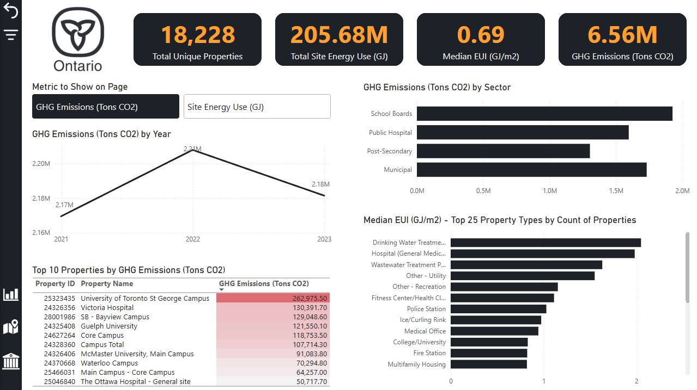

# Ontario BPS Energy & GHG Dashboard

A Power BI dashboard analyzing energy use and greenhouse gas emissions across Ontario's Broader Public Sector — every municipality, school board, university, college, and hospital reporting under O. Reg. 25/23.

**[View the live dashboard →](https://app.powerbi.com/view?r=eyJrIjoiMmQ1NzVhMWYtNjQ3MS00MzYwLTlhZmEtMWYxODEyYWViMTRkIiwidCI6IjNlYzYzMzRlLWM2MzUtNDM4Yy05YTczLThlM2M0N2JkM2RjZSJ9&pageName=473afd5e19814b8d12b7)**

## What this is

This is a companion project to the PL-300 (Power BI Data Analyst Associate) certification. The goal wasn't to chase a novel research finding — it was to take a real, messy, regulator-published dataset and build the kind of end-to-end BI product a working analyst actually ships: a cleaned star schema, a DAX layer that holds up under dynamic filtering, and a report that a non-technical stakeholder could open and immediately understand.

It's the second in a two-part portfolio pair. The first, [Ontario Energy Mix](https://github.com/ksprihar/ontario-energy-mix), is a SQL/Python project focused on analytical depth. This one is about BI-building competence — modeling, Power Query, DAX, and report design — on top of Ontario's public [BPS Energy Use and GHG Emissions](https://data.ontario.ca) dataset, covering 2021–2023 and roughly 18,000 unique reporting properties.

## What's in the report

Seven pages, all built around one idea: almost everything on the exec-facing pages is driven by a single metric toggle (GHG Emissions vs. Site Energy Use), so the same visuals restate themselves depending on what the viewer cares about, without needing five separate charts to say the same thing five different ways.

- **Exec Dashboard** — four KPI cards, a Year trend line, a Sector → Subsector drill-down bar chart, a Top 10 properties table (drillthrough-enabled), and a Median EUI by Property Type chart, all synced to the same metric slicer.
- **Map** — a bubble map sized by whichever of 7 metrics is selected (GHG, Site Energy, Electricity, Gas, Oil, Propane, Wood), with a Top N filter (10 / 20 / show all) and a spotlight card for the single top-ranked property.
- **Property Drillthrough** — click through from any property in the report to a single-building profile: gauges against property-type-specific targets, a multi-year trend, and identity cards.
- **Property Explore** — a twin of the Drillthrough page with one difference: instead of arriving pre-filtered to one building, this page has City/Organization/Property dropdown slicers so you can browse freely. (More on why this page exists below — it's one of the more interesting problems this build ran into.)
- **Three custom tooltip pages** (City, Sector, Property Type) — richer hover-over context than Power BI's default tooltip gives you for free.

A note on the Year trend chart: with only three years (2021–2023) in scope, it's the thinnest visual in the report right now. That's a data availability limit, not a design choice — as Ontario publishes more years under this reporting schema, that chart is the one that gets more useful with time, not less.

## A few problems worth mentioning

**Drillthrough filters can't be cleared by a bookmark, ever.** The original plan was a single Property Drillthrough page with an "Explore other buildings" button that cleared its own filter and revealed browsing slicers. That doesn't work — Power BI bookmarks structurally cannot capture or override a Drillthrough-type filter, no matter how they're configured. Confirmed by pulling the report file apart and comparing two bookmarks meant to do different things, which turned out to carry identical, valueless filter entries for the drillthrough field. The fix was architectural, not cosmetic: split into two pages. Drillthrough stays a true drillthrough (best UX for "jump straight to this one building"), and a twin, ordinary page holds the browsing UI, reached via a bookmark that both navigates there and force-resets it — since bookmarks *can* fully control an ordinary filter, just never a drillthrough one.

**A rank-based Top N filter was quietly wrong for one metric.** The Map page's Top N logic uses `RANKX` with dense ranking. That broke for Wood energy use specifically: only 3 properties report any wood consumption at all, so with dense ranking, everything past those 3 tied at the next rank — meaning "Top 10" and "show all" rendered identically for that one metric. Fixed with an explicit `[Selected Map Metric] <> 0` filter, once the actual cause (not a map bug, a ranking-mechanics edge case) was tracked down.

**Colors that were correct in Desktop reverted to default blue in the Service.** This one took three attempts. First, conditional formatting keyed to a specific measure's identity — broke the instant the field parameter switched to a different metric, since there was no matching rule for it. Second, a hardcoded color column on the parameter table with conditional formatting bound to that column by value — this fixed the line itself, but not the marker or tooltip swatch color, which turned out to be a *separate* format property in Power BI that doesn't inherit from the line's setting. The actual fix: temporarily let every metric render as its own series, hand-color each one, then collapse back to single-select. That bakes a permanent, named color entry for every possible metric directly into the visual — nothing left to fall back to a default on.

**A combo chart's tooltip disagreed with itself.** A line-and-column combo chart natively shows different tooltip content depending on whether you're hovering the bar or the line marker for the same category — a real, long-documented Power BI limitation, not a config mistake. Fixed with a custom Report Page tooltip, which is bound to the whole visual rather than per-series.

The full build log — every Power Query step, every DAX formula, every dead end — lives in **[Process.md](Process.md)**, for anyone who wants the complete, unfiltered version of how this was put together.

## Data & scope

- **Source:** [Ontario's Broader Public Sector Energy Use and GHG Emissions dataset](https://data.ontario.ca), published annually under O. Reg. 25/23.
- **Years:** 2021–2023 only. The source also has 2011–2020 under a materially different, less detailed legacy schema; reconciling two structurally different eras wasn't worth it for this project's scope, so it's scoped to the three years that share a consistent, richer schema. 2024 is excluded because that year's file drops School Board reporting entirely.
- **Grain:** one row per property per year in the fact table; a cleaned `Dim_Building` table carries each property's most recent reported attributes (name, sector, location, property type).

## Running this yourself

The three source Excel files (2021–2023, `raw_data/`) are included in this repo, so you can pull the pbix and follow along.

Just opening `bps-energy-ghg-dashboard.pbix` needs nothing extra — a `.pbix` carries a compressed copy of the data inside it, so the report browses and filters fine on its own.

If you want to hit **Refresh** and re-run the actual Power Query pipeline, you'll need to repoint the source step first: open Power Query Editor, select the query for each year (`2021`, `2022`, `2023`), and update its source file path to wherever you cloned `raw_data/` on your own machine. The path is currently hardcoded to my local folder structure, so Refresh will fail with a file-not-found error until that's updated — this isn't a bug, just something to do once after cloning.

## Tech

Power BI Desktop (Power Query / M for transformation, DAX for the semantic layer), a star schema (`Fact_Energy`, `Dim_Building`, `Dim_Year`), Field Parameters for dynamic metric switching, bookmarks for interactive state management, and Report Page tooltips for custom hover context.

## Design

Dark theme (`#1D2128`) with a single accent color (`#FF9E20`) used consistently for anything meant to draw the eye — KPI values, the active series in a chart, highlighted table rows. Ontario's trillium logo recolored to match. Kept deliberately restrained rather than colorful, on the theory that a report using ten colors makes none of them mean anything.

---

*Built by Karan as a portfolio project. See [Process.md](Process.md) for the full data cleaning log, star schema design rationale, and dashboard build history.*
